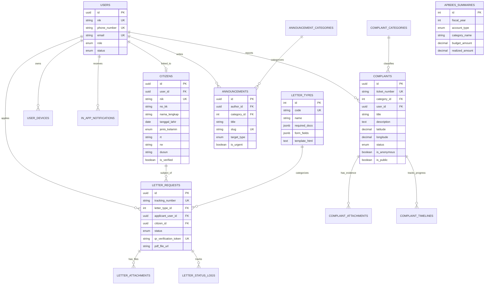

# Dokumen Desain Basis Data: Aplikasi "Dekati"
*(Desa Kita Dekat di Hati)*

Dokumen ini memuat arsitektur basis data relasional untuk sistem layanan desa terpadu **Dekati**, mencakup diagram ERD, spesifikasi tabel, aturan integritas data, serta mekanisme kepatuhan terhadap regulasi privasi data (UU Perlindungan Data Pribadi).

---

## 1. Entity Relationship Diagram (ERD)

---

## 2. Rincian Modul & Struktur Tabel

### A. Modul Pengguna & Kependudukan (Auth & Citizen Registry)
1. **`users`**:
   - Menyimpan kredensial autentikasi.
   - Pendaftaran menggunakan NIK dan No HP (WhatsApp).
   - Memiliki peran (*roles*): `superadmin`, `kades`, `admin_desa`, `petugas_layanan`, `ketua_rt_rw`, `warga`.
2. **`citizens`**:
   - Berfungsi sebagai **Buku Induk Kependudukan (Master Data)** desa.
   - Mengatasi kasus *1 Kepala Keluarga mengajukan surat untuk anggota keluarga lain*: Satu akun `users` dapat mengelola beberapa subjek warga di `citizens` berdasarkan Nomor KK yang sama.
   - Memuat status verifikasi identitas fisik (KTP/KK).

### B. Modul Layanan Surat Menyurat
1. **`letter_types`**:
   - Katalog jenis surat (SKTM, SKCK Pengantar, Domisili, Keterangan Usaha, Kematian, dll).
   - Menggunakan format kolom fleksibel `form_fields` (JSONB) dan `required_docs` (JSONB) sehingga penambahan jenis surat baru tidak perlu mengubah struktur tabel fisik.
2. **`letter_requests`**:
   - Transaksi pengajuan surat oleh warga.
   - Memiliki `tracking_number` unik (misal: `SRT-202609-0001`) yang dapat dicek kapan saja.
   - Memuat `qr_verification_token` untuk validasi legalitas dokumen digital tanpa perlu login.
3. **`letter_attachments` & `letter_status_logs`**:
   - Menyimpan berkas prasyarat dan jejak audit (*audit trail*) riwayat persetujuan atau alasan revisi/penolakan.

### C. Modul Pengaduan & Aspirasi Warga
1. **`complaint_categories`**:
   - Klasifikasi aduan: Jalan Rusak, Lampu PJU Mati, Sampah Menumpuk, Penyaluran Bansos, Pelayanan Aparatur.
2. **`complaints`**:
   - Tiket pengaduan warga dilengkapi koordinat GPS (*geotagging*) dan alamat spesifik.
   - Mendukung opsi `is_anonymous` (identitas pelapor disamarkan untuk keamanan privasi warga) dan `is_public` (apakah bisa dilihat oleh warga lain di feed desa).
3. **`complaint_timelines`**:
   - Riwayat tindak lanjut oleh petugas desa, termasuk unggah bukti foto pengerjaan di lapangan (misal: foto jalan setelah ditambal).

### D. Modul Berita, Pengumuman, & APBDes
1. **`announcements`**:
   - Fitur siaran berita desa dengan segmentasi penerima (`all`, per `dusun`, per `rw`, per `rt`).
   - Penanda `is_urgent = TRUE` mentrigger push notifikasi prioritas tinggi ke ponsel warga.
2. **`apbdes_summaries`**:
   - Menyajikan pos Pendapatan, Belanja, dan Pembiayaan Desa per tahun anggaran untuk transparansi publik yang dapat divisualisasikan dalam bentuk grafik di aplikasi warga.

### E. Modul Perangkat & Notifikasi
1. **`user_devices`**:
   - Menyimpan token Firebase Cloud Messaging (FCM) dari ponsel warga untuk push notification gratis dan real-time.
2. **`in_app_notifications`**:
   - Pusat notifikasi di dalam aplikasi (inbox) jika warga melewatkan push notification.

---

## 3. Aspek Keamanan & Privasi Data (UU PDP)

1. **Enkripsi Data Sensitif:**
   - Password disimpan menggunakan algoritma hashing standar tinggi (Argon2id atau Bcrypt).
   - NIK dan No KK pada layer penyimpanan dapat dipasangi index unik dan dienkripsi atau disamarkan (*masking*) pada tampilan publik (misal: `3201************`).
2. **Isolasi Berkas Kependudukan:**
   - Foto KTP, Kartu Keluarga, dan Selfie disimpan dalam *Private Cloud Storage bucket* (tidak publik). Akses dokumen oleh admin desa dilakukan melalui *pre-signed URL* dengan batas waktu kedaluwarsa (misal: valid selama 15 menit).
3. **Validasi Legalitas Surat Berbasis QR Code:**
   - Surat digital yang diterbitkan mencantumkan QR Code yang merujuk pada:
     `https://[domain-desa]/v/surat/{qr_verification_token}`
   - Publik/instansi luar (Kepolisian, Bank, Kecamatan) dapat memverifikasi keaslian surat tanpa perlu meminta hak akses ke database desa.
