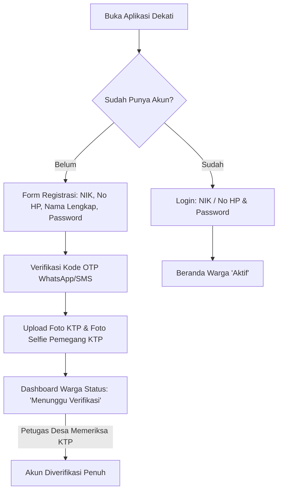
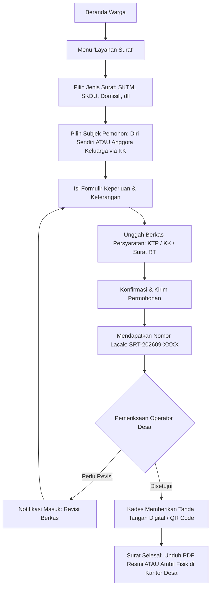
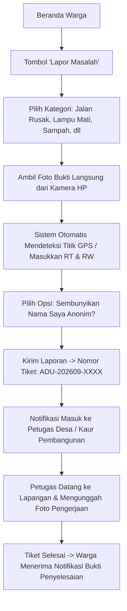

# Desain Wireframe Antarmuka & Alur Layar (UI/UX Flow): Aplikasi "Dekati"
*(Desa Kita Dekat di Hati)*

Dokumen ini memuat panduan desain pengalaman pengguna (UX), sistem desain visual, alur perjalanan pengguna (*user journeys*), serta diagram struktur layar (*wireframes*) untuk dua antarmuka utama:
1. **Aplikasi Warga (Mobile App - Android/iOS & PWA)**
2. **Dasbor Perangkat Desa (Web Admin Dashboard)**

---

## 1. Prinsip Desain & Sistem Visual (Design System)

### A. Karakteristik Pengguna Pedesaan
* **Aksesibilitas Tinggi:** Target pengguna mencakup kelompok usia produktif hingga lanjut usia. Ukuran tombol dibuat besar (*touch target* minimal $48\times 48\text{ px}$), tipografi berukuran minimal $15\text{ px}$, dan kontras rasio warna memenuhi standar WCAG AA ($> 4.5:1$).
* **Bahasa Sehari-hari:** Menghindari jargon teknis IT atau istilah birokrasi berbelit. Menggunakan istilah sederhana (misal: *"Lapor Masalah"* alih-alih *"Ticketing System"*, *"Urus Surat"* alih-alih *"Pelayanan Administrasi Kependudukan"*).
* **Hemat Kuota & Cepat Diakses:** Tata letak dirancang bersih tanpa animasi berat, gambar dioptimalkan secara adaptif, dan mendukung mode offline sederhana.

### B. Palet Warna (Color Palette)
| Nama Warna | Kode Hex | Penggunaan |
| :--- | :--- | :--- |
| **Emerald Green (Hijau Desa)** | `#16A34A` | Warna primer: Header, tombol aksi utama (*CTA*), status sukses/selesai. Menyimbolkan kemakmuran dan kedekatan warga dengan desa. |
| **Deep Forest (Hijau Gelap)** | `#14532D` | Teks judul utama, navbar aktif, identitas instansi. |
| **Ocean Blue (Biru Layanan)** | `#0284C7` | Warna sekunder: Informasi surat, tautan, ikon panduan. |
| **Amber Warning (Kuning Siaga)** | `#D97706` | Status permohonan *"Sedang Diproses"*, info perbaikan. |
| **Crimson Urgent (Merah Darurat)** | `#DC2626` | Pengumuman darurat/bencana, kontak ambulans, penolakan berkas. |
| **Neutral Canvas (Latar Belakang)** | `#F8FAFC` | Latar aplikasi bersih, nyaman di mata di bawah terik matahari. |
| **Slate Text (Teks Kontras)** | `#0F172A` | Warna teks utama dengan keterbacaan tinggi. |

---

## 2. Alur Perjalanan Pengguna (User Journeys & Flow)

### A. Alur Registrasi & Verifikasi Warga (Mobile App)


### B. Alur Pengajuan Surat Mandiri & Anggota Keluarga


### C. Alur Pengaduan Fasilitas Publik


---

## 3. Desain Wireframe Antarmuka Mobile (Aplikasi Warga)

### Layar 1: Beranda Utama Warga (Home Screen)
```text
+-------------------------------------------------------------+
| [LOGO DESA]  Desa Sukamaju               [Notif (3)] [Foto] |
| Halo, Bpk. Ahmad Subarjo (RT 02 / RW 01)                    |
+-------------------------------------------------------------+
| [!] BANNER DARURAT: Pembagian BLT-Dana Desa Mulai Pukul 09.00|
|     Sabtu, 21 September 2026 di Balai Desa. [Lihat Detail >]|
+-------------------------------------------------------------+
| STATUS TERAKHIR                                             |
| [Surat Keterangan Usaha] - Menunggu Tanda Tangan Kades      |
| Nomor: SRT-202609-0012            [Lacak Pengajuan >]       |
+-------------------------------------------------------------+
| LAYANAN UTAMA DESA                                          |
|  +---------------+  +---------------+  +---------------+    |
|  |  [IKON DOK]   |  |  [IKON SERU]  |  |  [IKON UANG]  |    |
|  |  Urus Surat   |  |  Lapor Aduan  |  | Transparansi  |    |
|  |    Online     |  |    Warga      |  |    APBDes     |    |
|  +---------------+  +---------------+  +---------------+    |
|  +---------------+  +---------------+  +---------------+    |
|  |  [IKON KEL]   |  |  [IKON AMB]   |  |  [IKON BUKU]  |    |
|  | Data Keluarga |  | Kontak Darurat|  |  Profil Desa  |    |
|  +---------------+  +---------------+  +---------------+    |
+-------------------------------------------------------------+
| KABAR DESA TERBARU                               [Lihat Semua]|
| [Foto Berita] Jadwal Vaksinasi Balita Posyandu Melati       |
|               2 hari lalu • 142 dilihat                     |
| [Foto Berita] Gotong Royong Pembersihan Saluran Irigasi     |
|               4 hari lalu • 230 dilihat                     |
+-------------------------------------------------------------+
| [Beranda]      [Layanan]      [Aspirasi]      [Akun Saya]   |
+-------------------------------------------------------------+
```

### Layar 2: Formulir Pengajuan Surat Mandiri & Keluarga
```text
+-------------------------------------------------------------+
| [< Kembali]         Pengajuan Surat Baru                    |
+-------------------------------------------------------------+
| JENIS SURAT                                                 |
| [ Surat Keterangan Tidak Mampu (SKTM)                   v ] |
+-------------------------------------------------------------+
| SURAT INI DIAJUKAN UNTUK:                                   |
| ( ) Diri Sendiri (Ahmad Subarjo - 3201012345670001)         |
| (*) Anggota Keluarga (Pilih dari Kartu Keluarga):           |
|     +-----------------------------------------------------+ |
|     | [ Foto ] Siti Subarjo (Anak Kandung)                | |
|     |          NIK: 3201016543210002                      | |
|     +-----------------------------------------------------+ |
+-------------------------------------------------------------+
| KEPERLUAN SURAT                                             |
| [ Syarat pengajuan beasiswa pendidikan di perguruan tinggi ]|
+-------------------------------------------------------------+
| DOKUMEN PERSYARATAN                                         |
| 1. Foto Kartu Keluarga (KK)                                 |
|    [v] Terlampir otomatis dari profil terverifikasi         |
| 2. Surat Pengantar Ketua RT/RW (Foto)                       |
|    +------------------------------------------------------+ |
|    |  [ Kamera / Ambil Berkas ]  (pengantar_rt.jpg - 1.2MB)| |
|    +------------------------------------------------------+ |
+-------------------------------------------------------------+
| [!] Pastikan data yang dimasukkan sudah benar dan sah.      |
|                                                             |
| [             KIRIM PERMOHONAN SURAT                      ] |
+-------------------------------------------------------------+
```

### Layar 3: Detail Pelacakan Surat & Dokumen Ber-QR Code
```text
+-------------------------------------------------------------+
| [< Kembali]        Lacak Permohonan Surat                   |
+-------------------------------------------------------------+
| No. Registrasi: SRT-202609-0012                             |
| Jenis Surat   : Surat Keterangan Tidak Mampu (SKTM)         |
| Pemohon       : Siti Subarjo (Diajukan oleh: Ahmad Subarjo) |
+-------------------------------------------------------------+
| RIWAYAT PROSES                                              |
| [v] 19 Sep, 08:30 - Permohonan Dikirim oleh Warga           |
| [v] 19 Sep, 09:15 - Berkas Diverifikasi oleh Operator Desa  |
| [v] 19 Sep, 10:00 - Disetujui & Diterbitkan No. 470/12/SKTM |
| [v] 19 Sep, 10:20 - Ditandatangani Elektronik oleh Kades    |
| [!] STATUS: SELESAI (Siap Diunduh / Diambil)                |
+-------------------------------------------------------------+
| PRATINJAU KEABSAHAN DOKUMEN RESMI                           |
| +---------------------------------------------------------+ |
| |                    PEMERINTAH DESA                      | |
| |                 SURAT KETERANGAN RESMI                  | |
| |                                                         | |
| |   [ QR CODE RESMI ]  Dokumen ini sah & ber-QRCode resmi| |
| |                      Validasi: desa.id/v/s/4f8a92       | |
| +---------------------------------------------------------+ |
|                                                             |
| [           UNDUH SURAT DIGITAL (PDF RESMI)               ] |
| [           KIRIM FILE KE WHATSAPP SAYA                   ] |
+-------------------------------------------------------------+
```

### Layar 4: Formulir Lapor Pengaduan Fasilitas (Geotagging)
```text
+-------------------------------------------------------------+
| [< Kembali]           Lapor Masalah Warga                   |
+-------------------------------------------------------------+
| KATEGORI LAPORAN                                            |
| [ [X] Jalan Rusak ]   [ [ ] Lampu Jalan ]   [ [ ] Sampah ]  |
+-------------------------------------------------------------+
| FOTO BUKTI LAPANGAN                                         |
| +---------------------------------------------------------+ |
| | [ + Ambil Foto Kamera ]    [ Foto_Jalan_Lubang.jpg ]    | |
| +---------------------------------------------------------+ |
+-------------------------------------------------------------+
| JUDUL LAPORAN                                               |
| [ Jalan Berlubang Parah Dekat Jembatan RT 03              ] |
|                                                             |
| KETERANGAN LENGKAP                                          |
| [ Lubang cukup dalam sekitar 30 cm, membahayakan pengendara]|
|                                                             |
| LOKASI OTOMATIS (GPS)                                       |
| [X] Gunakan titik GPS saya saat ini (-6.2088, 106.8456)     |
| Alamat: Jl. Raya Desa Km 2, RT 03 / RW 01                   |
+-------------------------------------------------------------+
| PENGATURAN PRIVASI                                          |
| [ON] Sembunyikan nama saya dari publik (Lapor Anonim)       |
| [ON] Tampilkan aduan ini di feed warga desa                 |
+-------------------------------------------------------------+
| [                   KIRIM LAPORAN SEKARANG                ] |
+-------------------------------------------------------------+
```

---

## 4. Desain Wireframe Dasbor Web (Perangkat Desa & Kades)

### Layar Dasbor Admin (Web Panel Resolusi Desktop $1440\times 900$)
```text
+---------------------------------------------------------------------------------------------------------------+
| [LOGO] DEKATI ADMIN  |  Desa Sukamaju, Kec. Ciawi      | Cari data (NIK/Surat/Aduan)... | [Bell(5)] | [Admin Budi v]|
+----------------------+----------------------------------------------------------------------------------------+
| NAVIGASI UTAMA       | RINGKASAN LAYANAN DESA HARI INI                                                        |
| [O] Dashboard Utama  | +-----------------+  +-----------------+  +-----------------+  +--------------------+  |
| [ ] Verifikasi Warga | | Surat Masuk     |  | Perlu Tanda Tgn |  | Aduan Belum Tuntas | Warga Terdaftar    |  |
| [ ] Pelayanan Surat  | | 18 Permohonan   |  | 4 Dokumen Kades |  | 3 Laporan        | 1.450 Jiwa (94%)   |  |
| [ ] Pengaduan Warga  | +-----------------+  +-----------------+  +-----------------+  +--------------------+  |
| [ ] Siaran Informasi |                                                                                        |
| [ ] Transparansi APB | DAFTAR PERMOHONAN SURAT TERBARU (MEMBUTUHKAN TINDAKAN)                     [Lihat Semua]|
| [ ] Master Data      | +------------------+-------------------+-----------+-----------------+---------------+  |
| [ ] Laporan Kades    | | No. Tracking     | Nama Warga / NIK  | Jenis     | Tgl Pengajuan   | Aksi          |  |
|                      | +------------------+-------------------+-----------+-----------------+---------------+  |
|                      | | SRT-202609-0015  | Siti Subarjo      | SKTM      | 19 Sep, 08:30   | [Proses] [Tolak]|
|                      | | SRT-202609-0014  | Joko Santoso      | Domisili  | 19 Sep, 07:45   | [Proses] [Tolak]|
|                      | | SRT-202609-0013  | Budi Setiawan     | SKCK      | 18 Sep, 16:20   | [Siap Cetak]  |  |
|                      | +------------------+-------------------+-----------+-----------------+---------------+  |
|                      |                                                                                        |
|                      | TIKET ADUAN WARGA PERLU TINDAK LANJUT                                                  |
|                      | * [ADU-202609-0008] Jalan Rusak di RT 03 - Ditugaskan ke: Kaur Pembangunan [Update]    |
|                      | * [ADU-202609-0007] Lampu PJU Mati RT 01 - Ditugaskan ke: Sie Ketertiban    [Selesai]   |
+----------------------+----------------------------------------------------------------------------------------+
```

### Layar Verifikasi Surat & Tanda Tangan QR Digital
```text
+---------------------------------------------------------------------------------------------------------------+
| [< Kembali]  Detail Permohonan Surat: SRT-202609-0015 (SKTM)                                                  |
+--------------------------------------------------------------------+------------------------------------------+
| DATA PEMOHON & SUBJEK SURAT                                        | BERKAS PERSYARATAN LAMPIRAN              |
| Nama Subjek  : Siti Subarjo                                        | 1. Kartu Keluarga (Valid)  [Lihat Foto]  |
| NIK Subjek   : 3201016543210002                                    | 2. KTP Pemohon (Valid)     [Lihat Foto]  |
| Akun Pengaju : Ahmad Subarjo (Ayah Kandung / Kepala Keluarga)      | 3. Pengantar RT 02/RW 01   [Lihat Foto]  |
| Alamat       : Dusun Mekar RT 02 / RW 01, Desa Sukamaju            +------------------------------------------+
| Keperluan    : Pengajuan Beasiswa Universitas                      | NOMOR SURAT RESMI DESA                   |
| Tanggal Masuk: 19 September 2026 - 08:30 WIB                       | [ 470 / 15 / Kesra / IX / 2026         ] |
+--------------------------------------------------------------------+------------------------------------------+
| CATATAN VERIFIKASI / PERBAIKAN                                                                                |
| [ Berkas pengantar RT dan KK lengkap dan telah sesuai.                                                      ] |
+---------------------------------------------------------------------------------------------------------------+
| TINDAKAN OPERATOR / KADES:                                                                                    |
| [ Minta Revisi Berkas ke Warga ]     [ Tolak Pengajuan ]     [ SAHKAN & TERBITKAN QR DIGITAL (TTE) ]           |
+---------------------------------------------------------------------------------------------------------------+
```

---

## 5. Fitur Aksesibilitas Khusus Warga Desa

1. **Tombol Cepat Hubungi Bantuan Kantor Desa:**
   * Di setiap formulir pengajuan, terdapat tombol melayang (*Floating Action Button*) hijau: *"Butuh Bantuan? Tanya Petugas Desa via WA"*, yang langsung membuka chat resmi operator kelurahan.
2. **Status Warna yang Kontras & Jelas:**
   * **Kuning:** Sedang Diverifikasi
   * **Biru:** Sedang Ditandatangani
   * **Hijau:** Selesai / Dokumen Siap
   * **Merah:** Ada Berkas Kurang (Perlu Perbaikan)
3. **Notifikasi Suara / Getar Ringan:**
   * Saat pengumuman penting/darurat diterbitkan kades, aplikasi mengirimkan suara notifikasi khusus agar menarik perhatian warga lansia.
